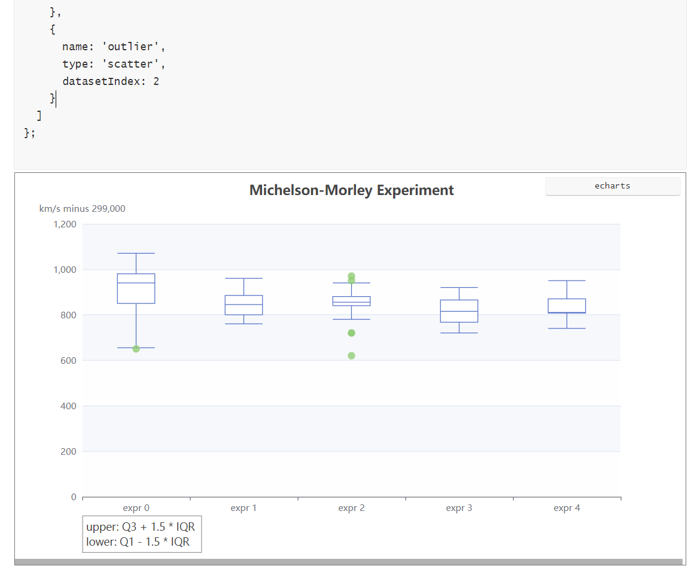

# mdECharts

在Typora中实现输入代码通过ECharts解析成图表的功能。

适用版本：Typora V1.5.9 for Windows

另外还有其他功能在逐步添加中。

## 安装

1. 下载 `echarts.min.js`和 `parsecharts`文件，保存至Typora安装目录下或其他合适位置
2. 打开 `C:\Program Files\Typora\resources\window.html`（或者你的自定义安装目录下的该文件），在文件末尾 `</html>`前添加如下语句（前后顺序不能换，注意 `<b>`**`file://`**`</b>`以及路径分隔符用 **`/`**）

   ```html
   <script src="file://D:/yourSavePath/echarts.min.js"></script>
   <script src="file://D:/yourSavePath/ecStat.min.js"></script>
   <!-- <script>var MDexport = true;</script> -->
   <script src="file://D:/yourSavePath/parsecharts.js"></script>
   ```
3. 重新启动Typora即可输入相关语法。

或者您也可以编辑 `D:\Program Files\Typora\resources\appsrc\window\frame.js`，在最后加入下载的3个js文件的内容。

## 使用

1. 绘制ECharts图

输入\`\`\`echarts进入代码块后，

```echarts
option 800x500
// 首行不会被执行，而是解析参数：图表类型 大小 svg/canvas
// 下面的全部代码会被eval，不用声明option={}，可写js代码
option = {
  title: [
    {
      text: 'Michelson-Morley Experiment',
      left: 'center'
    },
    {
      text: 'upper: Q3 + 1.5 * IQR \nlower: Q1 - 1.5 * IQR',
      borderColor: '#999',
      borderWidth: 1,
      textStyle: {
        fontWeight: 'normal',
        fontSize: 14,
        lineHeight: 20
      },
      left: '10%',
      top: '90%'
    }
  ],
  dataset: [
    {
      // prettier-ignore
      source: [[850, 740, 900, 1070, 930, 850, 950, 980, 980, 880, 1000, 980, 930, 650, 760, 810, 1000, 1000, 960, 960],
[960, 940, 960, 940, 880, 800, 850, 880, 900, 840, 830, 790, 810, 880, 880, 830, 800, 790, 760, 800],
[880, 880, 880, 860, 720, 720, 620, 860, 970, 950, 880, 910, 850, 870, 840, 840, 850, 840, 840, 840],
[890, 810, 810, 820, 800, 770, 760, 740, 750, 760, 910, 920, 890, 860, 880, 720, 840, 850, 850, 780],
[890, 840, 780, 810, 760, 810, 790, 810, 820, 850, 870, 870, 810, 740, 810, 940, 950, 800, 810, 870]
            ]
    },
    {
      transform: {
        type: 'boxplot',
        config: { itemNameFormatter: 'expr {value}' }
      }
    },
    {
      fromDatasetIndex: 1,
      fromTransformResult: 1
    }
  ],
  tooltip: {
    trigger: 'item',
    axisPointer: {
      type: 'shadow'
    }
  },
  grid: {
    left: '10%',
    right: '10%',
    bottom: '15%'
  },
  xAxis: {
    type: 'category',
    boundaryGap: true,
    nameGap: 30,
    splitArea: {
      show: false
    },
    splitLine: {
      show: false
    }
  },
  yAxis: {
    type: 'value',
    name: 'km/s minus 299,000',
    splitArea: {
      show: true
    }
  },
  series: [
    {
      name: 'boxplot',
      type: 'boxplot',
      datasetIndex: 1
    },
    {
      name: 'outlier',
      type: 'scatter',
      datasetIndex: 2
    }
  ]
};
```

结果如下：



**首行格式**：

`option [[800x]500 svg|canvas]`

`图表格式 widthxheight  渲染模式`

图表格式目前就照搬ECharts的，不想写新的解析代码了，需要哪种类型直接去[ECharts官网](https://echarts.apache.org/examples/en/index.html)取用。

2. 添加自定义样式

输入\`\`\`style回车进入代码块（仅注入第一个style代码块的内容）输入css样式即可，在切换文件时会更新一次。例如：

```style
/* style代码添加css样式，在切换文件时应用，导出时自动隐藏
*/
#write * {
	font-family:SimSun;
	font-size:11pt;
}
```

### 导出PDF、HTML

文件->偏好设置->导出->PDF->插入额外内容

```html
<style>.md-diagram-panel-preview, svg {page-break-inside: avoid;} /*防止图像被分隔在两页*/</style>
<script src="file://D:/yourSavePath/echarts.min.js"></script>
<script src="file://D:/yourSavePath/ecStat.min.js"></script>
<script>var MDexport = true;</script>
<script src="file://D:/yourSavePath/parsecharts.js"></script>
```

`MDexport` 用于指示parsecharts立即解析绘制图像，去除动画。因为导出时不会等待timeout等的阻塞。

## 版权

小工具，版权随ECharts的Apache License V2。
